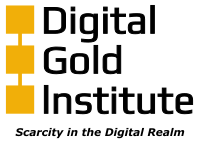

### Color

Our gold is:

* RGB 241 175 9
* HEX f1af09  
* CMYK 0 27 96 5

### Font

Our font is Play, the uppercase i is actually a lowercase l

## Logos

* [dgi-logo.svg](./dgi-logo.svg): black letters, gold icon, transparent  
  
* [dgi-logo-neg.svg](dgi-logo-neg.svg): white letters, gold icon, transparent  
  
* [dgi-logo-neg-mono.svg](dgi-logo-neg-mono.svg): white letters, white icon, transparent  
  

## Logos with tagline

* [dgi-tagline-logo.svg](./dgi-tagline-logo.svg): black letters, gold icon, transparent  
  
* [dgi-tagline-logo-neg.svg](dgi-tagline-logo-neg.svg): white letters, gold icon, transparent  
  
* [dgi-tagline-logo-neg-mono.svg](dgi-tagline-logo-neg-mono.svg): white letters, white icon, transparent  
  

## Icons

* [dgi-icon-rot.svg](dgi-icon-rot.svg): gold icon, horizontal, transparent  
  
* [dgi-icon.svg](dgi-icon.svg): gold icon, vertical, transparent  
  
* [dgi-icon-neg-mono-rot.svg](dgi-icon-neg-mono-rot.svg): white icon, horizontal, transparent  
  
* [dgi-icon-neg-mono.svg](dgi-icon-neg-mono.svg): white icon, vertical, transparent  
  
